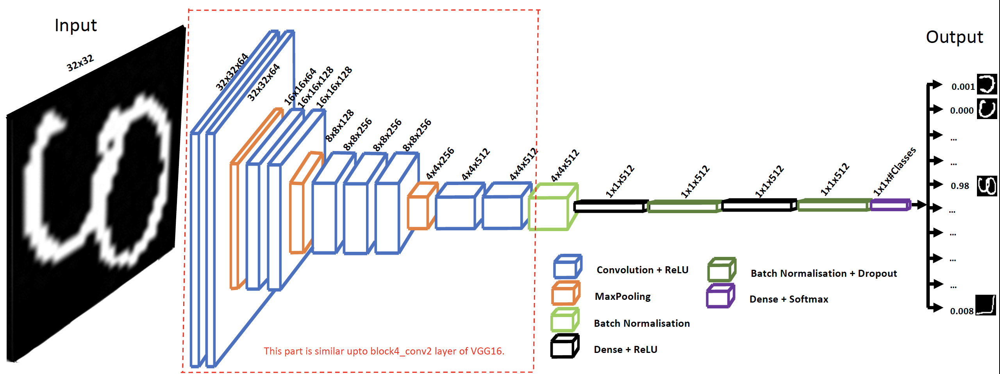
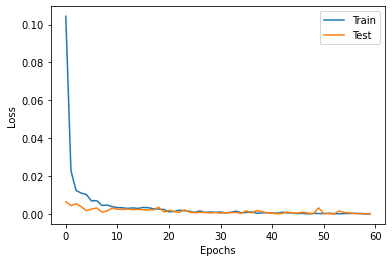
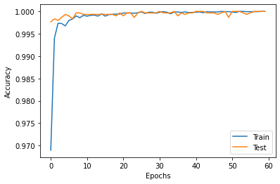

HCR-Lib: A Deep Learning Library for Script Independent Handwritten Character Recognition
=========================================================================================
Chauhan, V. K., Singh, S., & Sharma, A. (2022) HCR-Lib: A Deep Learning Library for Script Independent Handwritten Character Recognition.


## About HCR-Lib
Handwritten character recognition (HCR) is an important pattern recognition problem that lacks research on script independent models. This is because of complexity and diversity of scripts, different handwriting styles, use of handcrafted feature extraction, and unavailability of codes and datasets to reproduce and extend the existing research. HCR-Lib presents the first script independent deep learning library for HCR. It is an open source, very easy to use with any scripts, easy to extend, and a readable and portable library. The library establishes several new benchmarks on publicly available datasets of 14 languages on 40 datasets.


NOTE: This library is also used to reproduce experiments in the following paper for HCR-Net model:

[[1] Chauhan, V. K., Singh, S., & Sharma, A. (2021) HCR-Net: A deep learning based script independent handwritten character recognition network. arXiv preprint arXiv:2108.06663.](https://arxiv.org/abs/2108.06663)


## ARCHITECTURE
HCR-Lib is an implementation of HCR-Net, whose architecture is given below.

<p align="center">

</p>


## Folder and File Structure
----------------------------
<pre>
./                                  - This is top directory.
./README.md                         - This is readme file.
./HCR-Net.ipynb                     - This Jupyter Notebook contains implementation of HCR-Net [1]. By default, it runs with UCI Devanagari Numeral dataset, but you need to change this to run with your script.
./HCR-Net-Augmentation.ipynb        - This Jupyter Notebook runs HCR-Net with image-augmentation.
./Study-miss-classification.ipynb   - This Jupyter Notebook is used study mis-classification of HCR-Net.
./learning_rate.py                  - This python file implements custom learning rates used by HCR-Net.
|data/                              - Contains the datasets used in the expriments
|exps/                              - Contains raw files used for running experiments with different scripts as reported in paper.
|results/                           - This folder contains trained models (on UCI Devanagari Numeral dataset).
|figures/                           - This folder contains images of architecture and convergence results.
</pre>    


This documentation provides information to the users and developers for using HCR-Lib.


Table of Contents
=================
- Installation
- Quick Start Example
- Run your script
- More Information


## Installation
- Download the latest version of the library from the following URL: https://github.com/jmdvinodjmd/HCR-Net
- Prerequisite:
    + Tensorflow, seaborn and sklearn.
I think, as long as these libraries are compatible with each other, the code should run with any version and should produce results similar to reported in the paper.

## Quick Start Example
It's very easy to run the library - simply run the 'HCR-Net.ipynb' jupyter notebook. This will run the HCR-Net model with default dataset, i.e., UCI Devanagari Numeral dataset, present in the data folder. Please cite the data source from [here](https://archive.ics.uci.edu/ml/datasets/Devanagari+Handwritten+Character+Dataset).

The experimental results for running HCR-Net with UCI Devanagari Numeral dataset are given below.

<p align="center">
&nbsp; &nbsp; &nbsp; &nbsp;
</p>
<br /><br />

## Run your script
- To run your script without image-augmentation, please open 'HCR-Net.ipynb' jupyter notebook and change the following:
    + path of data folders
    + number of samples
    + number of classes

You may like to set number of epochs and learning rate for phase one and two or batch-size.
- Similarly, to run your script with image-augmentation, you need to use 'HCR-Net-Augmentation.ipynb', and to study mis-classification, you have to use 'Study-miss-classification.ipynb'.

It is recommended to run this code for at least 5 times due to randomness associated with different machines/architectures. For this you can set seed from 1-5.


## More Information
HCR-Lib is an open source library, released under the MIT license, and provides an implementation of HCR-Net deep learning model for handwriting character recognition.

If you find this code useful, then please consider citing following work:
```
Chauhan, V. K., Singh, S., & Sharma, A. (2022) HCR-Lib: A Deep Learning Library for Script Independent Handwritten Character Recognition.

Chauhan, V. K., Singh, S., & Sharma, A. (2021) HCR-Net: A deep learning based script independent handwritten character recognition network. arXiv preprint arXiv:2108.06663.
```

## Contact us
[Vinod Kumar Chauhan](https://sites.google.com/site/jmdvinodjmd/)